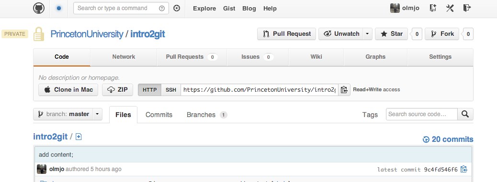
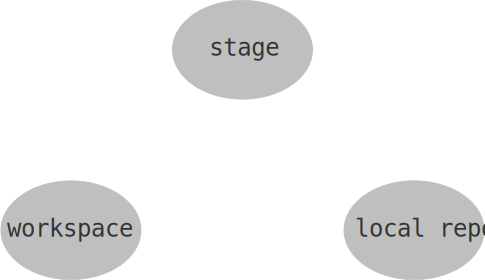
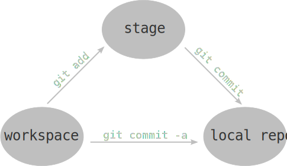
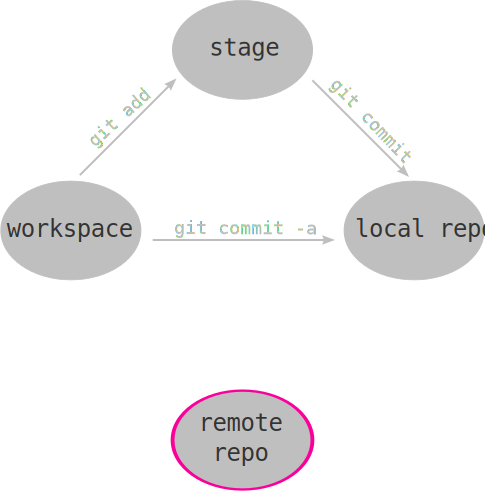
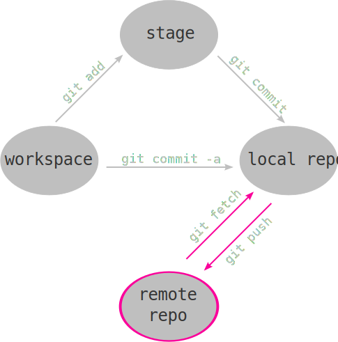

% Managing (collaborative) projects efficiently through version control software: An introduction to *git*
% Jonathan Olmsted
% Jan 25 2013


# Overview of the Talk
1. version control

2. git

3. git + github @ princeton

4. git + github @ princeton w/ collaborators

5. details for later


# Preliminaries
### Caveats

+ this is not the authoritative resource on *git* or [github.com](http://www.github.com)

+ those exist and you should use them

+ the goal of today's workshop is **to make using these resources easier for
everyone** by **providing a working knowledge of the concepts and terminology**

+ certain concepts (and `commands`) are deliberately not covered
    1. `branch`, `merging`
	2. `rebase`
	3. `checkout`
	4. `revert`
	

# Preliminaries
### Goals


Once this workshop is over you should feel comfortable:

1. going back to your office and installing *git* (or telling your graduate student to do so), 

2. starting to use *git* and [github.com](http://www.github.com) for the first time,

3. looking for help on using *git* (invariably, a new user will need this) and
[github.com](http://www.github.com)


# Preliminaries
### Materials

Everything related to this presentation will be available online and
version controlled:
[github.com/PrincetonUniversity/intro2git](https://github.com/PrincetonUniversity/intro2git)




*but clearly this picture was taken when it was still private*


# Version Control

If you are unfamiliar with the concept, think:

+ Microsoft Word's *track changes*, or
+ a sequence of edits that you can move between using *undo* and *redo*


# Version Control

Except, version control is more sophisticated:

+ we keep a permanent record

+ we can have multiple sequences *branch* off and *merge* back

+ we don't have to send around a monolithic file

+ we operate on an entire directory, not a single file

# Version Control
### Flavors

Although we'll focus on *git*, you may be familiar with others:

+ *mercurial*

+ *bazaar*

+ *cvs*, and

+ *subversion*

# Version Control
### Comparative Advantage

Target audience is projects making heavy use of plain text files:

+ website development

+ document preparation in LaTeX

+ R, Stata, Python, C++

### Comparative Disadvantage

Lots of binary files:

+ a music library

+ PDFs


# git 
### Use

+ command line (cross platform) for now

+ but GUI options are available for Windows, Mac, and Linux


\ 
\ 

### Assumptions

1. you have installed *git*, and
2. done the (simple) initial configuration

# git
### First Pass

+ single-user

+ completely local


# git

### Basic Operations

+ creating a repository

+ tracking files

+ staging changes

+ committing changes

+ checking the status

+ viewing the log

# git 
### Creating a Repo(sitory)

Inside your project directory, use `git init`:

```
git init
```

*git* tells us it worked:

```
machine:bio user$ git init
Initialized empty Git repository in /Users/user/Desktop/bio/.git/
```


# git
### Adding Content

I edit the file `bio.txt` to contain the beginning of a saga:

```
machine:bio user$ cat bio.txt 
I was born in June.
```

# git
### How does *git* feel about this?

Check the status of our *git* repo with `git status`:

```
git status
```

and we get informative output:

```
machine:bio user$ git status
# On branch master
#
# Initial commit
#
# Untracked files:
#   (use "git add <file>..." to include in what will be committed)
#
#	bio.txt
nothing added to commit but untracked files present (use "git add" to track)
```

# git
### Tracking Files/Staging Changes to Old Files

We follow *git*'s directions and use `git add`:

```
git add
```

but we get no output this time:


```
machine:bio user$ git add bio.txt 
```

# git
### 

Checking the status again, we see:

```
machine:bio user$ git status
# On branch master
#
# Initial commit
#
# Changes to be committed:
#   (use "git rm --cached <file>..." to unstage)
#
#	new file:   bio.txt
#
```

# git
### Committing 

We "save" these changes with `git commit`:

```
git commit -m "write first sentence"
```

and the output is full of information:

```
machine:bio user$ git commit -m "write first sentence"
[master (root-commit) 52ef49d] write first sentence
 1 file changed, 1 insertion(+)
 create mode 100644 bio.txt 
```

# git
### Loop through the Process : edit

I write more content and *git* talks about it like:

```
machine:bio user$ git status
# On branch master
# Changes not staged for commit:
#   (use "git add <file>..." to update what will be committed)
#   (use "git checkout -- <file>..." to discard changes in working directory)
#
#	modified:   bio.txt
#
no changes added to commit (use "git add" and/or "git commit -a")
```

# git
### Loop through the Process : add


I `add` all changed files to the stage:

```
machine:bio user$ git status
# On branch master
# Changes to be committed:
#   (use "git reset HEAD <file>..." to unstage)
#
#	modified:   bio.txt
#

```

# git
### Loop through the Process : commit

Now I `commit` these changes to the repository:

```
machine:bio user$ git commit -m "mention my dog"
[master 80169c2] mention my dog
 1 file changed, 1 insertion(+), 1 deletion(-)
```

# git
### History

Given that I've made significant progress, it might be time to see what I've done.

```
git log -p
```

gives

```
machine:bio user$ git log -p
commit 80169c255852aee28962d2ba909b9f5009178f9a
Author: olmjo <jpolmsted@gmail.com>
Date:   Thu Jan 24 15:15:14 2013 -0500

    mention my dog

diff --git a/bio.txt b/bio.txt
index 849edd4..ffcddef 100644
--- a/bio.txt
+++ b/bio.txt
@@ -1 +1 @@
-I was born in June.
+I was born in June. I took frequent rides on Spunky, a cocker spaniel.

commit 52ef49d5f109c05203ea6857bf36d7278a857546
Author: olmjo <jpolmsted@gmail.com>
Date:   Thu Jan 24 15:06:05 2013 -0500

    write first sentence

diff --git a/bio.txt b/bio.txt
new file mode 100644
index 0000000..849edd4
--- /dev/null
+++ b/bio.txt
@@ -0,0 +1 @@
+I was born in June.
```

# git
## Workflow Summary
### Normal Workspace


# git
## Workflow Summary
### Normal Workspace + *git* Locations



# git
## Workflow Summary
### Git 


# git
## Workflow Summary
### Git (for the fearless)



# 

# 

Breathe.


# git + github
### Second Pass

+ single-user

+ interact with a remote repo

# git + github
### github.com is:

+ the most popular *git* repo hosting site

+ very big community

+ credible signal (transparency makes it a costly)

### github.com is **not**:

+ wallet-friendly if you want to restrict who can see your project

# git + github @ princeton

Princeton University has a site license with [github.com](http://www.github.com).

\ 
\ 


You get:

+ unlimited public repos (and so does the rest of the world)
+ unlimited private repos (a big deal)
+ teams with varying privileges that can have multiple members

# git + github @ princeton
### Create a github.com Account

Go to [https://github.com/signup/free](https://github.com/signup/free).


# git + github @ princeton
### Create an Organizational Affiliation

Go to [Princeton Research Computing](https://www.princeton.edu/researchcomputing/services/github/).


# git + github @ princeton
### Create a Remote Private Repo


# git + github @ princeton
### Clone the Remote Repo


```
machine:Desktop user$ git clone https://github.com/PrincetonUniversity/intro2git.git
Cloning into 'intro2git'...
remote: Counting objects: 80, done.
remote: Compressing objects: 100% (46/46), done.
remote: Total 80 (delta 27), reused 68 (delta 18)
Unpacking objects: 100% (80/80), done.
```

# git + github @ princeton
### Work on Content

1. Edit
2. `git add`
3. `git commit`
4. Go to Step 1

# git + github @ princeton
### Pushing Changes in your Commit History to your Remote Repo

+ *git* assumes we want to talk to the remote repository that we `clone`-ed
  1. if you created the repo on github
  2. and then you cloned it

+ we do want that

\ 
\ 

We `push` the changes to our `commit` tree back to remote repository:

```
machine:intro2git user$ git push
Counting objects: 9, done.
Delta compression using up to 4 threads.
Compressing objects: 100% (4/4), done.
Writing objects: 100% (5/5), 395 bytes, done.
Total 5 (delta 3), reused 0 (delta 0)
To https://github.com/PrincetonUniversity/intro2git.git
   f3dde6f..5a328b1  master -> master
```

unless we didn't `commit` them:

```
machine:intro2git user$ git push
Everything up-to-date
```


# git + github @ princeton w/ collaborators
### (A Brief) Third Pass

+ single-user w/ multiple local repos/multi-user with write privs
+ communicate between multiple local repos via a remote repo

# git + github @ princeton w/ collaborators
### Remote



# git + github @ princeton w/ collaborators
### Pushing to Remote


# git + github @ princeton w/ collaborators
### Fetching from Remote



# git + github @ princeton w/ collaborators
### Collaborating (in practice)

1. there are many more commands and options

2. a little bit daunting at first

3. start off using *git* to do only a fraction of what it can


# Additional Information
### Installing *git*

For everyone:

+ [http://git-scm.com/downloads]([http://git-scm.com/downloads)

# Additional Information
### Official *git* Help

+ [http://git-scm.com/documentation](http://git-scm.com/documentation)

# Additional Information
### Official *git* setup for github.com

+ [https://help.github.com/articles/set-up-git#platform-all](https://help.github.com/articles/set-up-git#platform-all)

# Additional Information
### Official github.com Help

+ [https://help.github.com/](https://help.github.com/)

# Additional Information
### A *Really* Neat Interactive Demo

+ [http://try.github.com/levels/1/challenges/1](http://try.github.com/levels/1/challenges/1)


# Thanks!
